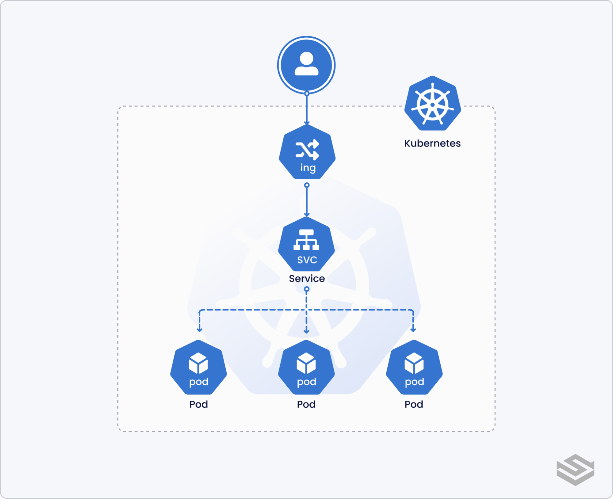

# ArgoCD Repository Template

This repository contains a template for managing Kubernetes applications using ArgoCD with a structured approach for different environments: test, staging, and production.

## argocd get password

```sh
kubectl -n argocd get secret argocd-initial-admin-secret -o jsonpath="{.data.password}" | base64 -d
```

## Kustomize

<https://github.com/kubernetes-sigs/kustomize>

## Project Structure

The project is organized into the following directories:

- **base**: Contains the base Kubernetes resources that are common across all environments.
  - `deployment.yaml`: Defines the Kubernetes deployment resource.
  - `service.yaml`: Defines the Kubernetes service resource.
  - `kustomization.yaml`: Kustomize configuration for the base resources.

- **overlays**: Contains environment-specific customizations.
  - **test**: Customizations for the test environment.
    - `kustomization.yaml`: Kustomize configuration for the test environment.
    - `values.yaml`: Configuration values specific to the test environment.
  - **staging**: Customizations for the staging environment.
    - `kustomization.yaml`: Kustomize configuration for the staging environment.
    - `values.yaml`: Configuration values specific to the staging environment.
  - **production**: Customizations for the production environment.
    - `kustomization.yaml`: Kustomize configuration for the production environment.
    - `values.yaml`: Configuration values specific to the production environment.

## Kubernetes setup



## Getting Started

1. **Clone the Repository**

   ```bash
   git clone <repository-url>
   ```

2. **Install environment**
  
  ```bash
  kubectl apply -k base
  ```

1. **Customize Your Environment**
   - Modify the `values.yaml` files in the respective environment overlays to suit your configuration needs.

2. **Deploying with ArgoCD**
   - Ensure you have ArgoCD installed and configured in your Kubernetes cluster.
   - Create an ArgoCD application pointing to the desired overlay (test, staging, or production).

## Contributing

Feel free to submit issues or pull requests for improvements or additional features.

## License

This project is licensed under the MIT License - see the LICENSE file for details.
